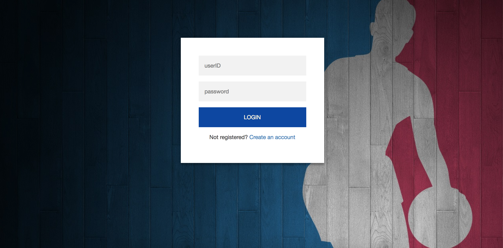
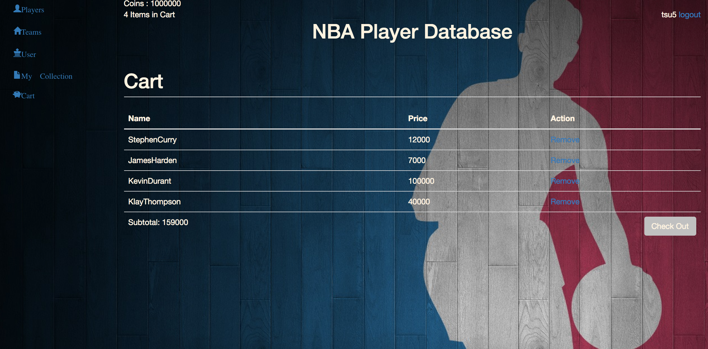

NBA-Player-Database
=====================

Relations:
-----------------
user
[customerID: VARCHAR(20), name:VARCHAR(30), hashingPassword: VARCHAR(20), bankAccount: BIGINT, gameCoins: BIGINT]

nbaTeams
[name: VARCHAR(20), city: VARCHAR(30), division: VARCHAR(20)]

PlayerCard
[playerID: INT, Name: VARCHAR(30), Position: CHAR(22), Height: Decimal, Weight: Decimal, age: INT, team: VARCHAR(20), color: VARCHAR(20), overall: INT, inside: INT, outside: INT, playmaking: INT, athleticism: INT, defense: INT, rebound: INT, Price: INT]

Cart
[userID: VARCHAR(20), serialNumber: INT]

MyCollection
[customerID: VARCHAR(20), SerialNumber: BIGINT]

SerialLibrary
[serialNumber: BIGINT, ID: INT, customID: VARCHAR(20)]

Function:
-----------------------------

Our web-interface enables users to pick their favorite player to form a team. When the sign-in interface shows, the user is prompted to enter the username and password. The input will be checked by the database to ensure matched results exist. Otherwise the user will be guided to create own account, and the user information table will be updated. The users can filter the player by characteristics to find best matched players, and them to collection. Such function is implemented in the backend by querying the database according to user's input. Users can pick players based on their positions, scoring abilities, teams and so on. Then those players will go into users’ carts, and users could check out by using game coins. After purchasing the players, their own teams will be updated, which is realized by updating the corresponding table in the database. Users can view their team lineup by clicking a “My Collection” button on the screen, which is realized by querying the ‘MyCollection’ table in the database.

Screenshots:
--------------------

